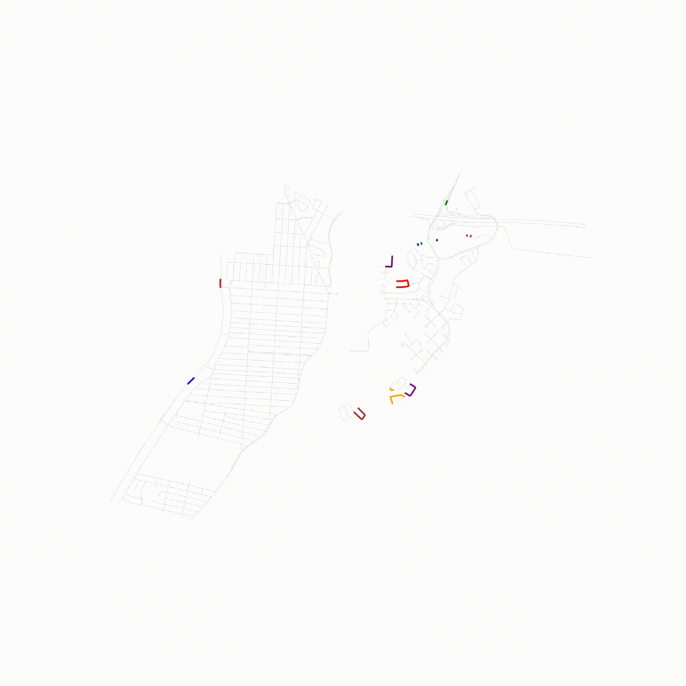

# Urban Snow Route Optimizer

This project allows optimizing the routes of snowplows and drones for urban snow removal.

## Installation

### Prerequisites
- Python 3.x
- pip (Python package manager)
- virtualenv (optional but recommended)

### Installing dependencies

#### Method 1: Quick installation
pip install -r requirements.txt

#### Method 2: Installation with a virtual environment (recommended)
# Install virtualenv if not installed
sudo pacman -S python-virtualenv

# Create the virtual environment
python -m venv myenv
source myenv/bin/activate

# Upgrade pip
pip install --upgrade pip

# Install dependencies
pip install -r requirements.txt

## Main dependencies
- networkx: For graph manipulation
- geopandas: For geospatial data processing
- shapely: For geometric operations
- scikit-learn: For optimization algorithms
- osmnx: For extracting OpenStreetMap data
- matplotlib: For visualization
- numpy & pandas: For data processing
- folium: For interactive map visualization
- tqdm: For progress bars
- unidecode: For handling special characters

## Usage

### Snowplow route optimization

1. Data preparation:
   - Make sure you have a GeoJSON file of your neighborhood in the `data/` folder
   - The file must contain streets and connectivity information between them

2. Running the program:
python main.py data/quartiers/your_neighborhood.json

3. Snowplow configuration:
   - Enter the maximum number of snowplows desired
   - Choose the type of snowplow:
     - Type 1:
       - Speed: 10 km/h
       - Rental cost: 500€
       - Cost per km: 1.1€
       - Hourly cost: 1.1€
     - Type 2:
       - Speed: 20 km/h
       - Rental cost: 800€
       - Cost per km: 1.3€
       - Hourly cost: 1.3€

4. Results:
   - An animation video (`deneigeuse_X.mp4`) showing the optimized route
   - The total estimated time for snow removal
   - The total cost of the operation including:
     - Snowplow rental cost
     - Fuel cost (based on distance)
     - Labor cost (based on time)

### Drone route optimization

To use the drone feature, run:
python main.py drone

## Project structure
- `algo/`: Contains optimization algorithms
- `drone/`: Code specific to drone route optimization
- `data/`: Data and neighborhood files
- `main.py`: Main entry point of the program

## Notes
- Neighborhood files must be in GeoJSON format
- Results are saved in the current directory
- Visualizations are generated in MP4 format
- For best results, make sure your GeoJSON file contains valid and well-connected street data

